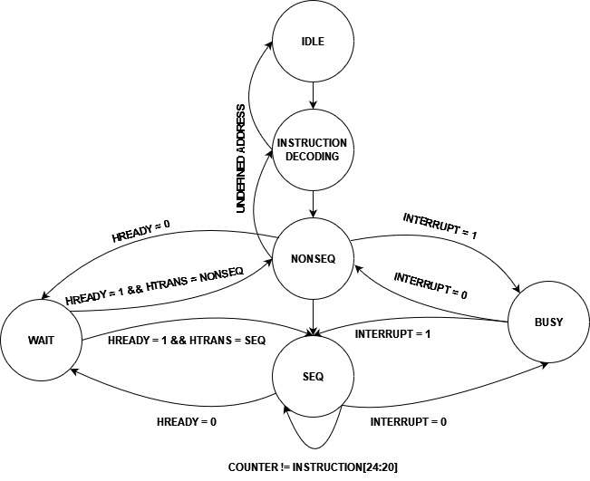
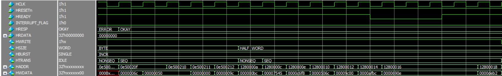

# AHB LITE 3 
## Table of Contents
# Table of Contents
- [Introduction](#introduction)
- [Master Module](#master-module)
  - [Diagram](#digram)
  - [Instruction Memory and Program Counter](#instruction-memory-and-program-counter)
  - [Register File](#register-file)
  - [Control Unit](#control-unit)
  - [FSM](#fsm)
- [Slaves (Data Memory)](#slaves-data-memory)
- [Simulation Waveforms](#simulation-waveform)
  - [Single Transactions](#single-transactions)
  - [Burst Transactions](#burst-transactions)
  - [Master Read Burst Transaction](#master-read-burst-transaction)
  - [Busy and Unidentified Instruction](#busy-and-unidentified-instruction)

## Introduction
AMBA AHB-Lite addresses the requirements of high-performance synthesizable 
designs. It is a bus interface that supports a single bus master and provides high-bandwidth operation.


An AHB-Lite master provides address and control information to initiate read and write operations.


An AHB-Lite slave responds to transfers initiated by masters in the system. The slave 
uses the HSELx select signal from the decoder to control when it responds to a bus 
transfer. The slave signals back to the master:
- the success
- failure
-  or waiting of the data transfer.


## Master Module

To impelement the Master interface, A simple module was made which only consists of a instruction memory, control unit and regsiter file.
### Digram


### Instruction Memory and Program Counter
First the Instruction Memory is intialized with all the instructions and then the Program counter passes by each instruction one by one.
In case of HREADY is low, it will make the program counter stall on the current instruction.

### Register File
This block is used to write data on the bus when HWRITE is HIGH and to read data on the bus while LOW.

### Control Unit
This block Takes the instruction and decodes it where
| Bits                  | Description  |
|-----------------------|--------------|
| Instruction[31:26]    | OPCODE         |
| Instruction[25]       | WRITE or READ
| Instruction[24:20]    | Number of INCR cycles         |       
| Instruction[19:8]     | Used later in slave    | 
| Instruction[7:0]      | Address for RegFile     |


| opcode                  | Description  |
|-----------------------|--------------|
| 6'b000_000    |     BURST SINGLE BYTE     |
| 6'b000_001    | BURST SINGLE HALF WORD         |       
| 6'b000_010       | BURST SINGLE WORD    | 
| 6'b000_011       | BURST INCR BYTE     |      
| 6'b000_100       | BURST INCR HALF WORD    | 
| 6'b000_101       | BURST INCR WORD     |

### FSM


## Slaves (Data Memory)
The Slaves used are different Data memories that reads and Writes the data according to the master's control signals, then Responds with HREADY and HRESP signals.

```sv
module slave_1(	    input HCLK,HRESETn,
		            input ERROR_FLAG,READY_FLAG,HSEL,
                    output HREADY,
		            output HRESP_E HRESP,
                    output reg [31:0] HRDATA,
                    input  HWRITE,
                    input  HSIZE_E HSIZE,
		            input HBURST_E HBURST,
                    input  HTRANS_E HTRANS,
                    input  [31:0] HADDR,
                    input  [31:0] HWDATA);

reg [7:0] DATA_MEM [0:255];
reg HWRITE_REG,HSEL_REG;
reg [31:0] HADDR_REG,HWDATA_REG;
HSIZE_E HSIZE_REG;
HTRANS_E HTRANS_REG;
HBURST_E HBURST_REG;
always@(posedge HCLK, negedge HRESETn)
 begin
  if(!HRESETn)
   begin
    HWRITE_REG<=0;
    HSEL_REG<=0;
    HADDR_REG<=0;
    HWDATA_REG<=0;
    HSIZE_REG <=WORD;
    HTRANS_REG<=IDLE;
    HBURST_REG<=SINGLE; 
   end
  else
   begin
    HWRITE_REG<=HWRITE;
    HSEL_REG<=HSEL;
    HADDR_REG<=HADDR;
    HWDATA_REG<=HWDATA;
    HSIZE_REG <=HSIZE;
    HTRANS_REG<=HTRANS;
    HBURST_REG<=HBURST; 
   end
 end
always@(posedge HCLK, negedge HRESETn)
begin
 if(!HRESETn)
  begin
   HRDATA<=0;
  end
 else if(HSEL_REG && (HTRANS_REG == NONSEQ || HTRANS_REG == SEQ) && HWRITE_REG && !ERROR_FLAG && READY_FLAG)
  begin
   case(HSIZE)
	BYTE:
	 begin
 	  DATA_MEM[HADDR_REG[7:0]]<=HWDATA_REG[7:0];
         end
	HALF_WORD:
	 begin
 	  {DATA_MEM[HADDR_REG[7:0]+1],DATA_MEM[HADDR_REG[7:0]]}<=HWDATA_REG[15:0];
         end
	WORD:
	 begin
 	  {DATA_MEM[HADDR_REG[7:0]+3],DATA_MEM[HADDR_REG[7:0]+2],DATA_MEM[HADDR_REG[7:0]+1],DATA_MEM[HADDR_REG[7:0]]}<=HWDATA_REG;
         end
	default:
	 begin
 	  DATA_MEM[HADDR_REG[7:0]]<=0;
         end
   endcase
  end
 else if(HSEL_REG && (HTRANS_REG == NONSEQ || HTRANS_REG == SEQ) && !HWRITE_REG && !ERROR_FLAG && READY_FLAG)
  begin
   case(HSIZE)
	BYTE:
	 begin
 	  HRDATA<={{24{1'b0}},DATA_MEM[HADDR_REG[7:0]]};
         end
	HALF_WORD:
	 begin
 	  HRDATA<={{16{1'b0}},DATA_MEM[HADDR_REG[7:0]+1],DATA_MEM[HADDR_REG[7:0]]};
         end
	WORD:
	 begin
 	  HRDATA<={DATA_MEM[HADDR_REG[7:0]+3],DATA_MEM[HADDR_REG[7:0]+2],DATA_MEM[HADDR_REG[7:0]+1],DATA_MEM[HADDR_REG[7:0]]};
         end
	default:
	 begin
 	  HRDATA<=0;
         end
   endcase
  end	   
end
assign HREADY = (!HRESETn)? 1:READY_FLAG;
assign HRESP = (!HRESETn)? OKAY: (ERROR_FLAG)? ERROR:OKAY;
endmodule
```

## Simulation Waveform
**NOTE: To view the operation of each module alone check the folders in the Repository**

### Single Transactions 

The Figure below shows Single transcations from each slave and one Burst transaction while the final transaction doesnt map to any slave so the default slave gives an ERROR response


### Burst Transations

The Figure below shows different Burst transaction with a case of not ready slave



### Master Read Burst Transaction 

The Figure Below Shows a read from slave transaction where the slave puts the data on the HRDATA bus.


### Busy and Unidentified Instruction

The Figure below shows a Case of Busy Master in a Burst transaction and then an unidentified Instruction


## Future Work
**More Slaves will be added to this module such as the timer LEDS module that was made before (you can view it in the current repository).**

**Busy at the end of an sequential incr to terminate the transaction was not handled in this module and will be handled in the future.**