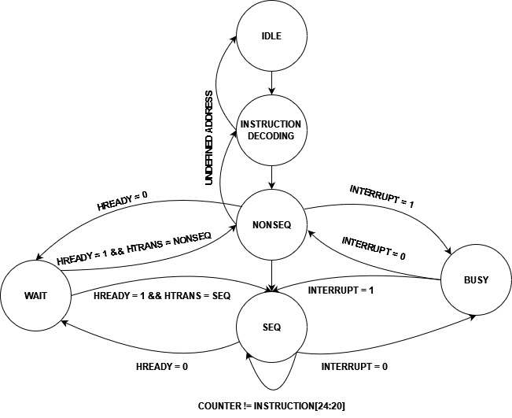
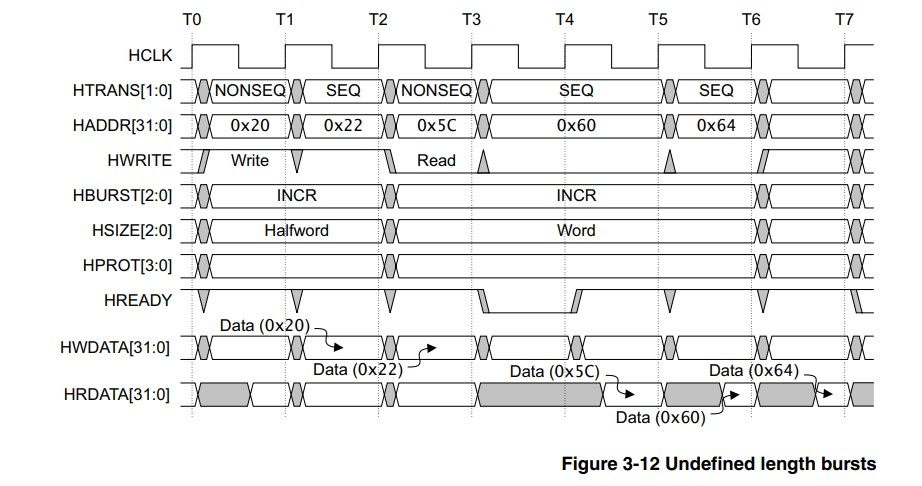

# AHB Lite 3 - Master Implementation
## Table Of Contents
- [AHB Lite 3 - Master Implementation](#ahb-lite-3---master-implementation)
  - [Table Of Contents](#table-of-contents)
  - [Introduction](#introduction)
  - [Master Module](#master-module)
    - [Digram](#digram)
    - [Instruction Memory and Program Counter](#instruction-memory-and-program-counter)
    - [Register File](#register-file)
    - [Control Unit](#control-unit)
  - [Simulations Waveforms](#simulations-waveforms)
    - [FSM](#fsm)
    - [Single Transfers](#single-transfers)
      - [Expected](#expected)
      - [Simulation](#simulation)
    - [Incr with Master busy](#incr-with-master-busy)
      - [Expected](#expected-1)
      - [Simulation](#simulation-1)
    - [Incr with Salve Not Ready](#incr-with-salve-not-ready)
      - [Expected](#expected-2)
      - [Simulation](#simulation-2)
    - [Incr with Salve Not Ready](#incr-with-salve-not-ready-1)
      - [Expected](#expected-3)
      - [Simulation](#simulation-3)
    - [Incr Then undefined Instruction](#incr-then-undefined-instruction)
      - [Expected](#expected-4)
      - [Simulation](#simulation-4)
## Introduction
AMBA AHB-Lite addresses the requirements of high-performance synthesizable 
designs. It is a bus interface that supports a single bus master and provides high-bandwidth operation.An AHB-Lite master provides address and control information to initiate read and write operations.

**NOTE: This Project was made according to the AHB Lite 3 Standard**

## Master Module

To impelement the Master interface, A simple module was made which only consists of a instruction memory, control unit and regsiter file.
### Digram

### Instruction Memory and Program Counter
First the Instruction Memory is intialized with all the instructions and then the Program counter passes by each instruction one by one.
In case of HREADY is low, it will make the program counter stall on the current instruction.

### Register File
This block is used to write data on the bus when HWRITE is HIGH and to read data on the bus while LOW.

### Control Unit
This block Takes the instruction and decodes it where
| Bits                  | Description  |
|-----------------------|--------------|
| Instruction[31:26]    | OPCODE         |
| Instruction[25]       | WRITE or READ
| Instruction[24:20]    | Number of INCR cycles         |       
| Instruction[19:8]     | Used later in slave    | 
| Instruction[7:0]      | Address for RegFile     |

| opcode                  | Description  |
|-----------------------|--------------|
| 6'b000_000    |     BURST SINGLE BYTE     |
| 6'b000_001    | BURST SINGLE HALF WORD         |       
| 6'b000_010       | BURST SINGLE WORD    | 
| 6'b000_011       | BURST INCR BYTE     |      
| 6'b000_100       | BURST INCR HALF WORD    | 
| 6'b000_101       | BURST INCR WORD     |

## Simulations Waveforms
### FSM

### Single Transfers
#### Expected
 

#### Simulation 

### Incr with Master busy
#### Expected
 

#### Simulation 

### Incr with Salve Not Ready
#### Expected
 

#### Simulation 

### Incr with Salve Not Ready
#### Expected

 

**NOTE: This image was taken from the AHB LITE 3 STANDARD**

#### Simulation 

**NOTE: HRDATA will take its values when implementing the slave this image is just showcasing  master's operation**

### Incr Then undefined Instruction
#### Expected
 

#### Simulation 

