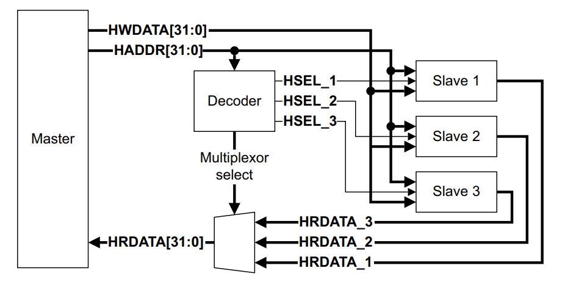
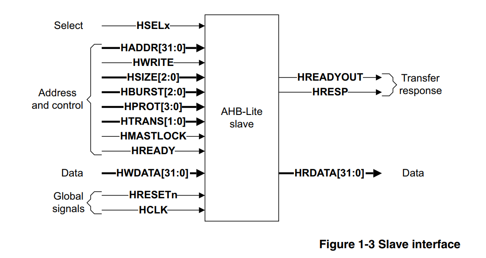
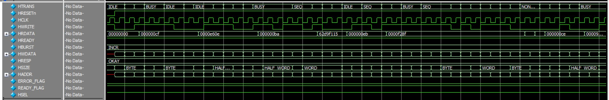
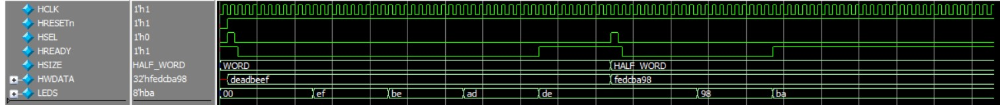

# AHB LITE 3 - SLave Implementation
## Table of Contents
- Introduction
- Slave 1 (Data Memory)
- Slave 2 (LEDS with Timer)
## Introduction
AMBA AHB-Lite addresses the requirements of high-performance synthesizable 
designs. It is a bus interface that supports a single bus master and provides high-bandwidth operation.

An AHB-Lite slave responds to transfers initiated by masters in the system. The slave 
uses the HSELx select signal from the decoder to control when it responds to a bus 
transfer. The slave signals back to the master:
- the success
- failure
-  or waiting of the data transfer.

## Slave 1 (Data Memory)
This Slave is a Data memory that reads and Writes the data according to the master's control signals, then Responds with HREADY and HRESP signals.
### Simulation Waveform

## Slave 1 (Data Memory)
This Slave is LEDS with Timer that reads the data according to the master's control signals and output it in the LEDS after a certain period of time, then Responds with HREADY. **where HREADY is always low when the counting is initiated**
### Simulation Waveform

